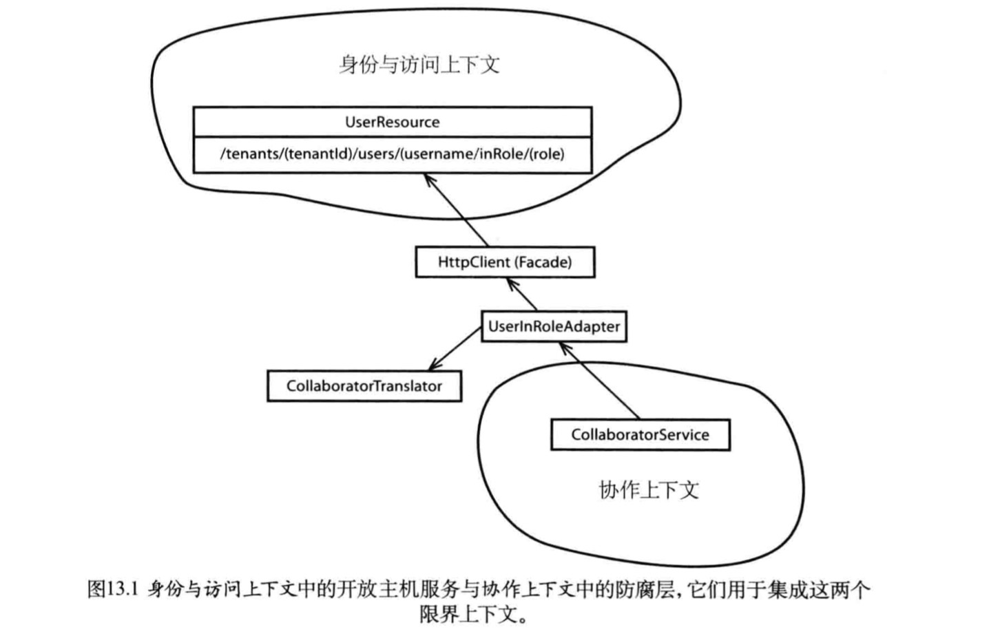

### 集成界限上下文

#### 学习路线

    1.restful集成上下文优缺点
    2.消息队列继承上下文优缺点
    3.如何维护重复的信息

#### 使用消息继承上下文

    1.使用消息机制继承上下文，任何系统都可以获得更高的自治性
    2.即使一个系统不可用，消息依然能够发出去
    3.在DDD中一种增强系统自治性的方法就是使用领域事件
    4.事件需要唯一性

#### 长时处理（状态机，跟踪器）