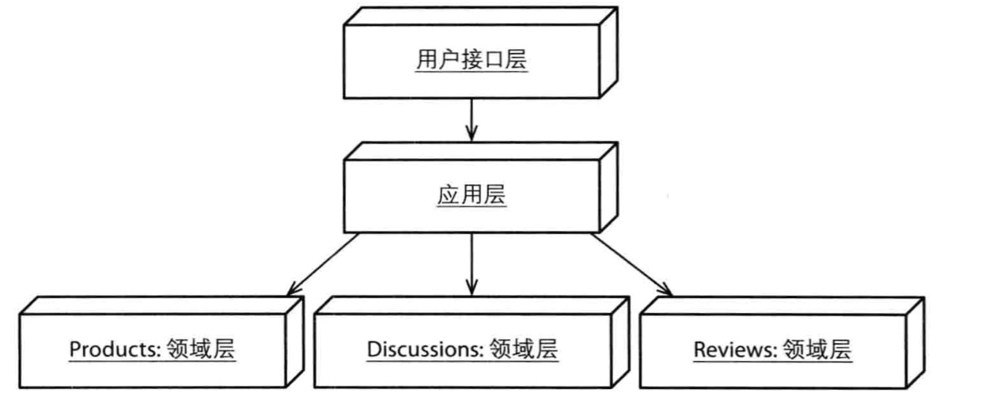

### 应用程序

#### 学习路线

    1.学习渲染领域模型的几种方式
    2.如何实现应用服务，以及它提供的操作
    3.输出从应用服务器解耦的几种方式，以及不同的客户端类型
    4.为什么要在用户界面中组合多个模型，以及怎么实现
    5.将基础设施用于应用程序实现的几种方式

#### DTO 渲染数据传输对象

    1.DTO包括需要显示的所有属性值
    2.DTO组装器
    3.数据的读写都是通过资源库显示的
    4.DTO主要在业务中创建的（适用与远程展示）

#### 使用调停者发布聚合的内部状态

    1.关注自己感兴趣的聚合状态（调停者内部）的渲染

#### 通过领域负载对象渲染聚合实例 DPO

    1.在没有必要适用DTO的时候，可以把多个聚合要显示的数据汇集到一个对象上面
    2.更加容易设计，简化数据传输的过程
    3.延迟夹在可以使用领域依赖求解器，它是一种策略模式

#### 处理不同的客户端

    1.应用服务可以使用一个数据转换器，适用双分派（调停者）生成所需要的数据格式

#### 渲染适配器以及处理用户编辑

    1.展现模型可以被看作是一种适配器（适配DTO，DPO）
    2.领域模型不需要对显示的数据做特别支持，只是展现模型的职责
    3.展现模型还可以跟踪用户的编辑

#### 应用服务

    1.应用服务负责用例流的协调
    2.适用ACID数据库的时候，应用层还要控制事务，还会处理和安全相关的操作
    3.展现模型汇集多个界限上下文的数据到视图，视图和应用服务交互

#### 解耦服务输出（另一种输入输出架构）

    1.标准输入输出接口，不同客户端不同的适配器

#### 组合多个界限上下文

    pp风格

#### 基础设施

    1.可以通过依赖注入或者服务工厂的方法来获取实例

#### 企业组件容器

    1.