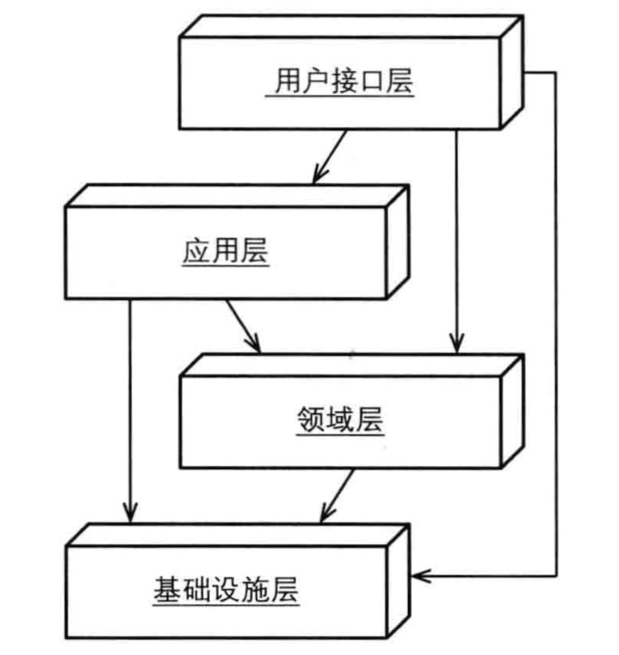

### 领域驱动设计：架构

> DDD的优势之一就是DDD不需要特定的架构，由于核心域在界限上下文当中，我们可以采用多种架构风格

#### 分层架构

    1.分层架构被认为是所有架构的始祖
    2.每一层只和下面的一层发生耦合(严格分层架构)
    3.当前层可以和下面任意一层发生耦合(松散分层架构)
    4.较低层有时也会和较高层发生耦合，比如订阅者和调停者的情况
    5.如果用户界面使用了领域对象，那么它只能用来坐展示渲染

#### 用户界面层

    1.用户界面只处理用户显示和请求，不包含业务逻辑
    2.如果使用了领域对象，那它只能用来渲染展现
    3.有时候也可以通过开放主机服务向外面提供API

#### 应用层

    1.应用层不处理领域业务逻辑，但是它却是领域层的直接用户
    2.应用层可用于创建持久化事物和安全认证，或者基于其他系统创建事件消息
    3.协调领域对象的操作，比如说聚合
    4.获取用户的命令和参数，再通过资源库获取到资源实例，最后进行相应的命令操作
    5.应用层应该很薄，创建实例通过工厂方法，然后通过资源库对其进行持久化
    6.有时候可以调用领域服务，操作应该是无状态的
    7.领域层发布事件，应用层可以去订阅，可以对事件进行储存和转发
    8.应用层有多种方式获取实现，依赖注入、服务工厂、插件
    9.采用依赖倒置，实际上就不存在分层的概念了

#### 六边形架构

    1.六边形架构分为内部区域和外部区域，外部区域提交输入，内部区域持久化数据
    2.六边形架构每条边代表处理端口，可以处理输入和输出

#### 面向服务架构

##### 服务设计原则:

    1.服务契约
    2.松耦合
    3.服务抽象
    4.服务重用
    5.服务自治理
    6.服务无状态性
    7.服务可发现性
    8.服务组合性

### 事件驱动架构

##### 管道和过滤器

    1.将大问题划分成若干个小步骤

##### 长时处理过程

    1.长时处理是一种事件驱动、分布式的并行处理模式（流分叉了）
    2.执行器、跟踪器
    3.当一个事件到达时候，跟踪器将检查执行的状态

##### 事件源

    1。跟踪领域模型的状态变化
    2.事件跟踪
    3.事件重放

##### 基于网格和基于网织的分布式计算

    1.聚合的唯一标识是标识key
    2.数据网织能够很好的和领域模型保持一致

##### 数据驱动网织和领域事件

    1.数据网织能够很好的支持事件驱动架构
    2.这些事件不能和领域事件相互混淆
    3.消息队列

##### 持续查询

    1.客户端向数据网织注册一个查询，缓存修改之后自动通知客户端

##### 分布式处理

    1.复制缓存内完成分布式处理