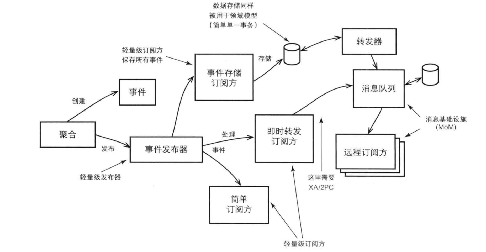

### 领域事件

#### 基本概念及特征

    1.用来捕获领域中发生的一些事情
    2.领域事件也是通用语言的一部分
    3.本地界限上下文中可以通过领域事件来保持同步
    4.用来保持本地系统和远程系统的一致性
    5.领域事件将业务分成特别小的事物单元，可以解耦复杂系统
    6.将集中处理的过程进行分散

#### 事件处理图

#### 建模领域事件

    1.事件由聚合操作上面的方法产生
    2.通常采用操作的方法名字来命名领域事件
    3.事件代表过去发生的事情，不能表示正在发生或者将来会发生的事情
    4.事件可以加上身份标识
    5.事件对象在创建之后就一般就不会再变了
    6.我们可以向事件中添加额外的状态和行为（e.preventDefault）

#### 创建具有聚合特征的领域事件

    1.有时候领域事件并不是由聚合产生的，而是客户方请求产生的，这个时候可以把事件建模成一个聚合，并且拥有自己的资源库，但是事件表示过去发生的事情，不能删除
    2.事件属性，唯一标识
    3.储存起来之后通过基础设施进行转发

#### 身份标识

    1.检查重复的事件消息，以免重复消费事件

#### 在领域模型中发布事件

    1.观察者模式
    2.聚合的一致性必须通过异步的方式进行

#### 向远程上下文发布领域事件

#### 消息设施的一致性

#### 服务自治和系统

    1.独立性

#### 容许延时

#### 事件储存

#### 转发储存事件的架构风格

    1.restful风格、消息中间件
    2.restful并不是真正意义上的事件转发机制，但是能够相同的效果
    3.restful适合多个客户消费一个发布，消息队列适合多个发送方对应多个消费方

#### 消息去重复、幂等操作