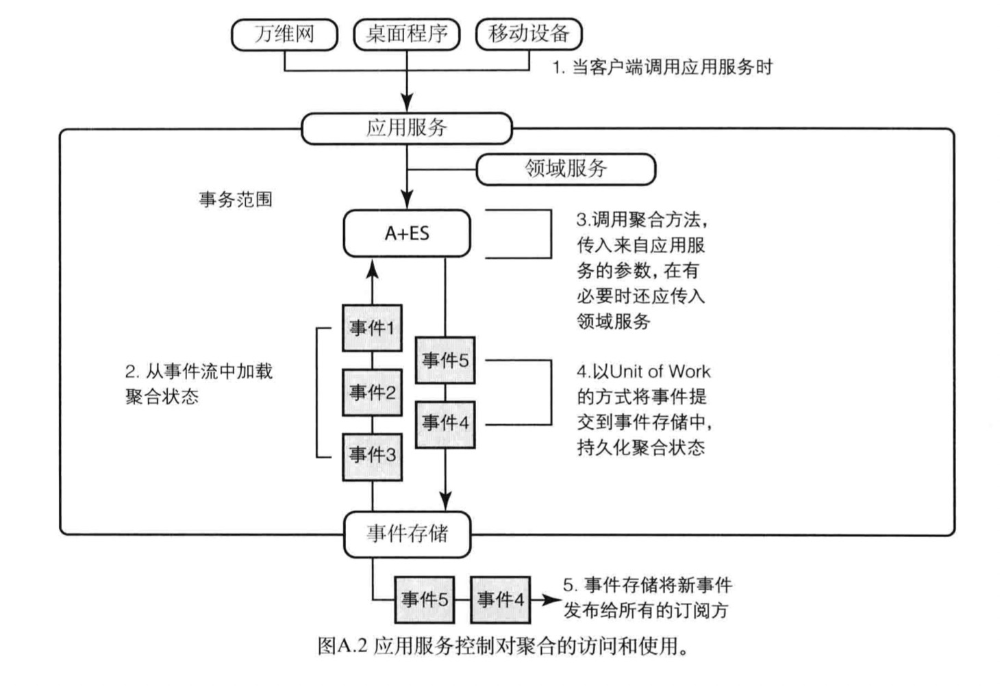
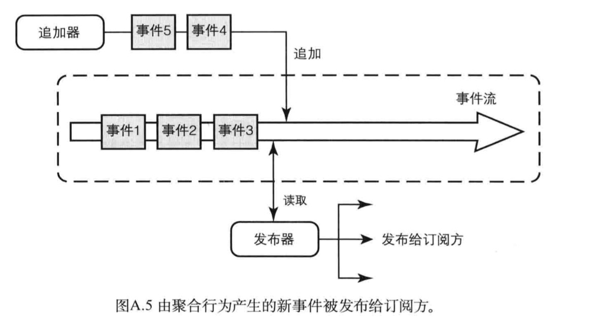
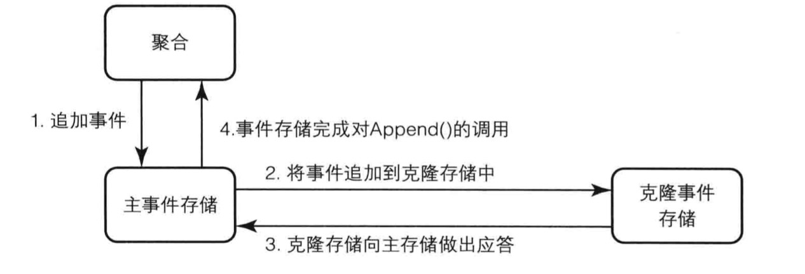
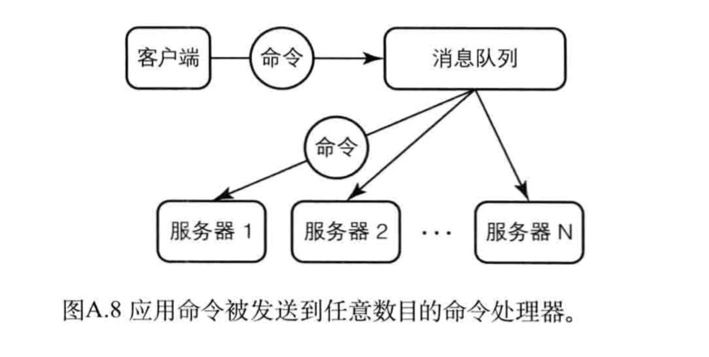
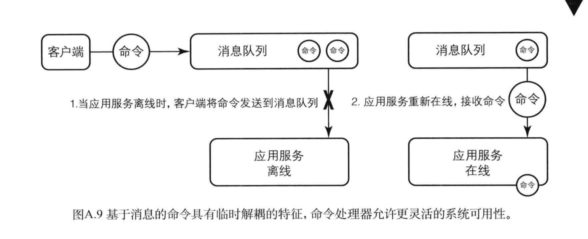

### 附录A

#### 聚合和事件源

    1.事件流，储存，事件重放，状态恢复
    2.优点：可靠性、短期/长期商业智能化、数据分析、全日志记录和调试，迫使开发者焦距于通用语言

#### 应用服务内部

***

***

#### 应用服务处理流程

    1.客户端调用应用服务中的某个方法
    2.获取所需要的领域服务来进行业务操作
    3.根据客户端传来的聚合实例唯一标识，获取相应的事件流
    4.根据事件流重建聚合实例
    5.在聚合上面进行业务操作
    6.发布新的事件作为操作的输出
    7.事件追加到事件流当中
    8.将事件通过消息设施发给订阅方

#### 命令处理器

    1.将客户端和应用服务解耦可以改进负载均衡、消费竞争、系统分区

