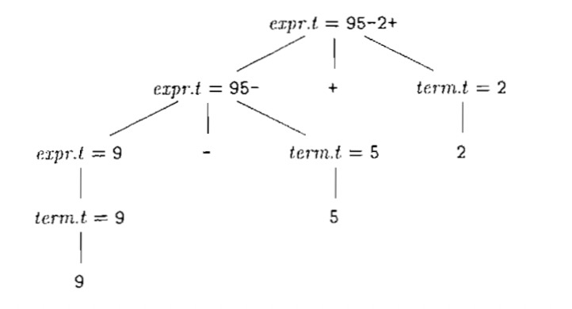
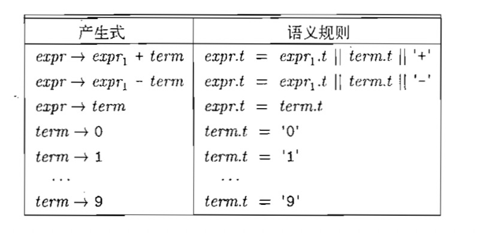
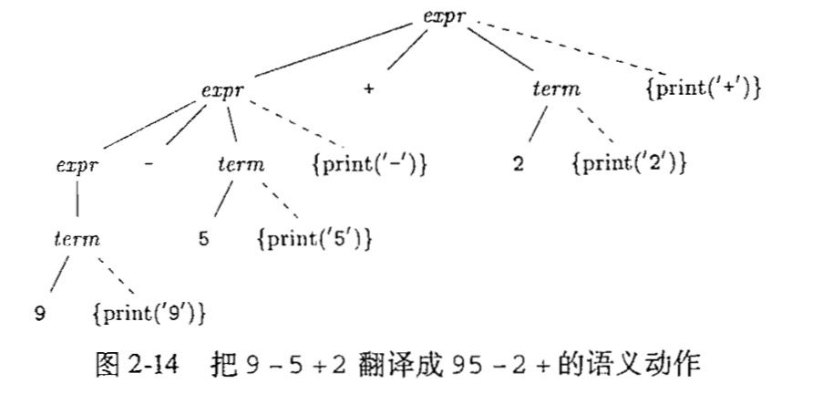
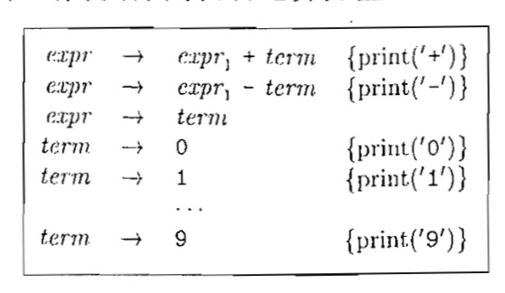

### 语法制导翻译

    1.它是一种面向文法的翻译技术
    2.三地址代码最多执行一个运算，计算、比较或者分支跳转
    3.x = y op z : 表示 y 和 z 执行一个二目运算，然后将结果方在 x 地址的地方

#### 语法定义

1. stm > **if** **(** expr **)** stm **else** stm
2. if 、（ 、）、else 终结符， stm、expr 非终结符

#### 文法的定义

**文法的组成**
    
    1.终结符号集合：是一个词法单元，是一个文法最基本的符号
    2.非终结符号结合：被称为语法变量，表示一个终结符号串的集合
    3.产生式集合
    4.指定一个非终结符号为开始符号

**词法单元**

    1.词法单元由两部分组成，名字和属性值
    2.如果词法单元有属性值，那么这个值是指向符号表的，表中包含附加的信息
    3.讨论语法分析的时候，词法单元和终结符号是同义词

**文法二义性**

    1.一个文法可能有多科语法分析树

**运算符的结合性**

    1.加减乘除是做结合的，指数运算是右结合的，a=b=c 也是右结合的
    2.一个右结合的文法 a=b=c
        right > letter = right | letter
        letter > a | b | c | d | ... | z
    
> 一个处于产生式左边的非终结符可以作为一个内部节点向下延伸出子节点，它是否意味这一个优先级呢？

**运算符的优先级**

考虑加减乘除的运算文法，它是左结合的

expr 和 term 分别表示两个不同的优先级，用factor来生成基本的单元

    factor  > digit | (expr)
    term > term * factor
    term > term / factor
    term > factor
    expr > expr + term
    expr > expr - term
    expr > term

****

**我们可以这样来这样理解上面的文法**

    1.上面的文法包含3个优先级，括号、乘除、加减
    2.n层优先级需要n+1个非终结符号，
    3.上面文法描述了一个非终结符只能被更高的优先级分开
    4.term可以被factor分开，expr可以被term分开

#### 2.3：语法制导翻译（本章中将中缀表达式翻译成后缀表达式）

    1.语法翻译制导是通过向产生式附加一些规则或者程序片段而得到的
    2.语法制导翻译的两个概念，属性和翻译方案

#### 综合属性和继承属性

##### 综合属性

    1.将属性和文法的非终结符号相关联
    2.产生式描述节点上面的属性计算规则
    3.每个文法符号和属性相关联，产生式规则计算符号的属性
    4.如果一个节点上面的属性由子节点和本身决定，那么它是一个综合属性，对注释语法树进行一次自底向上的遍历就可以了
    5.继承属性是由父节点、兄弟节点和本身决定的
    6.其中 || 表示连接
    7.计算综合属性可以采用自底向上的顺序遍历
    8.夹杂综合属性和继承属性的计算遍历是相当复杂的

#### 制导翻译
    
    1.可以在节点上面通过添加程序片段来完成制导翻译

## 练习

> 1.中缀表达式翻译成前缀表达式

    1.1:中缀表达式语法

    expr > expr + term
    expr > expr - term
    expr > term
    term > term * factor
    term > term / factor
    term > factor
    factor > digit | (exper)

    1.2.翻译语法

    expr > {print("+")} expr1 + term | 
           {print("-")} expr1 + term |
           term
    term > {print("*")} term * factor |
           {print("/")} term / factor |
           factor
    factor > {print(digit)} digit |
             (exper)

> 2.后缀表达式翻译成中缀表达式

    2.1: 后缀表达式语法

    expr > expr expr +
    expr > expr expr -
    expr > expr expr *
    expr > expr expr /
    expr > digit

    2.2: 语法制导翻译语法

    expr > expr {print("+")} expr +
    expr > expr {print("-")} expr -
    expr > {print("(")} expr {print(")*(")} expr {print(")")} *
    expr > {print("(")} expr {print(")/(")} expr {print(")")} /
    expr > {print(digit)} digit

3.整数翻译成罗马数字
4.罗马数字翻译成整数

> 5.后缀翻译成前缀表达式

    expr -> expr expr op | digit

    expr -> {print(op)} expr expr op | digit {print(digit)}

***

