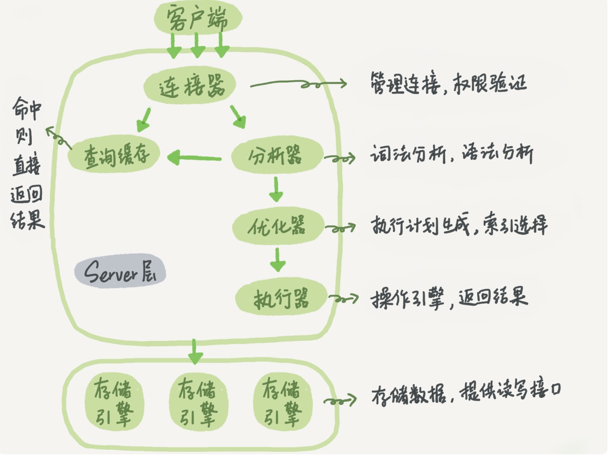

### mysql的基础架构

#### 架构图

#### 关于缓存和连接

    1.执行一个内存大的查询最好要将连接重制一下
    2.连接长时间处于空闲状态会被断开，默认8个小时
    3.最好不要用缓存，因为表的更新会使得缓存清空
    4.如果要使用缓存，表需要长时间不会变化，比如配置

***

### 日志系统：一条sql语句的执行过程

**mysql可以恢复到半个月内的任何一秒的状态**

#### redo log  innoDB层  循环写入

    1.当执行一条跟新语句的时候 innoDB引擎会先将记录写到redo log 然后在更新内存、
    2.在适当的时候将redo log里面的记录写进磁盘，然后擦除redo log
    3.redo log并不一定要全部擦除完
    4.redo log 可以保证数据库异常重启，也能保证数据不会丢失

#### binlog  server层 归档日志

    1.binlog处于server层，所有的引擎都能够使用
    2.redolog记录数据发生了什么变化，binlog记录语句的原始逻辑
    3.redolog是循环写入的，binlog是追加写入的，不会覆盖前面的记录

#### 两阶段提交

    1.保证 redolog 和 binlog 的日志记录是一致的

***

### 事务隔离 为什么你改了我还是看不见？

> 思考转账的例子

> 事物隔离保证一组操作要么全部成功，要么全部失败

> 事物隔离是在引擎层实现的

> myslam 引擎不支持事务隔离， innodb引擎支持事务隔离

#### 隔离性和隔离级别

    1.