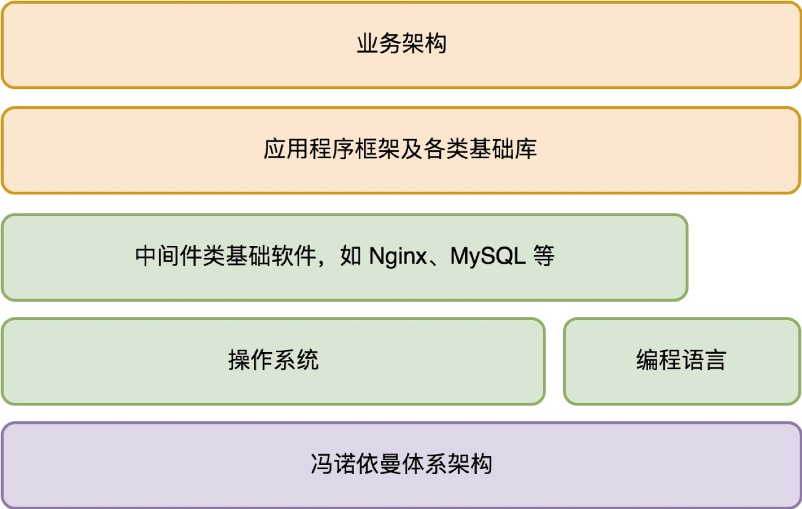

### 优秀架构师

#### 基本素养

1.把控全局

2.不要陷入细节，除非它影响你构建世界

3.关注用户需求，成为业务专家，并预测变化

***

#### 市面上架构书籍分类

1.**架构思维类** : 这些书籍大都偏向与理论，比如架构设计的一些选择（开闭原则、单一指责、依赖倒置、接口分离）etc

2.**设计模式类** : 进入架构的局部细节，每个模式的来龙去脉并不容易理解

3.**分布式系统架构** : 通常从服务端的通用问题如一致性、高可用、高并发挑战等

4.**重构类** : 讲怎么把坏代码一步步改进到好代码。我认为这是最实用的一类

***

### 架构设计的宏观视角

#### 基本

1.**电脑架构** ： 中央处理器 + 储存 + 一系列的输入输出设备

2.**通信方式** ：接口只负责写入和读取数据

3.**依赖方式** ：可编程性、开放设计外部设备接口

***

#### 业务架构图

***

#### 架构的本质

> 架构能力的提升本质是对知识反复的梳理和融汇贯通